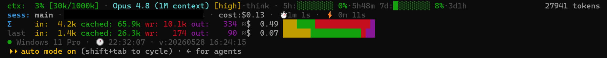
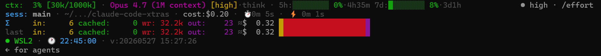

# Claude Code Xtras

A collection of AI agent skills, instruction, and Claude Code tooling I'm using or experimenting with (often both!). 

**Important: these assets and tools are shared as they exist on my profile, may need adjustment and further testing to make them work properly for you.**

## Skills

| Skill                                        | Description                                                                                                                                                                                                                                                    |
| -------------------------------------------- | -------------------------------------------------------------------------------------------------------------------------------------------------------------------------------------------------------------------------------------------------------------- |
| [lisa-loop](skills/lisa-loop/)               | Time gated protocol, inspired by Ralph Loop and Lisa Simpson. The skill I use to force agents to keep working until X time passed.                                                                                                                             |
| [plan-dotnet-app](skills/plan-dotnet-app/)   | Generate a build plan for .NET 10 Blazor Web Apps with Blazor Blueprint, EF Core, Playwright testing, and GitHub Actions CI. (from workshops)  If you want instead a ready to use starter repo see: https://github.com/rquintino/copilot-blazor-template |
| [md2docx](skills/md2docx/)                   | The skill I use to convert markdown folders into word documents (ex. to share on my workshops, while we dont have markdown office standards 😉)                                                                                                                |
| [pseudocode-rules](skills/pseudocode-rules/) | Write LLM instruction files (CLAUDE.md, agent policies, sandbox profiles) as compact pseudocode DSL — `deny()`/`allow()`/`require()` call sites with `# why` comments. Backed by recent research hinting  pseudocode > prose for instruction following.        |

## Instructions

| Profile                                              | Posture                                                                                                                                                                                                                                                                                                                             |
| ---------------------------------------------------- | ----------------------------------------------------------------------------------------------------------------------------------------------------------------------------------------------------------------------------------------------------------------------------------------------------------------------------------- |
| [dev-soft-sandbox](instructions/dev-soft-sandbox.md) | Soft project-scoped policy for agents: no side effects outside current folder, no credential access, stick to current folder work, no installs, no override.    Obviously you can't trust LLMs will stick to this 100%, but shoudn't hurt. Just another layer.   "I'm sorry Dave, I'm afraid I can't do that." style 🤖 |

> **No guarantees.** These profiles are *soft* — instructions the model is asked to follow, not enforced at the OS level. Use them as one defense layer alongside real isolation (VM/container, sandbox). Advanced Prompt injection or a misbehaving tool can bypass any rule here.

## [Status Line](statusline/)

Everything I could pack and can't live without while using claude code cli. This and claude --verbose. 😁

Includes both a PowerShell port ([`statusline.ps1`](statusline/statusline.ps1)) and a bash port ([`statusline-command.sh`](statusline/statusline-command.sh)).

## License

[MIT](LICENSE)
